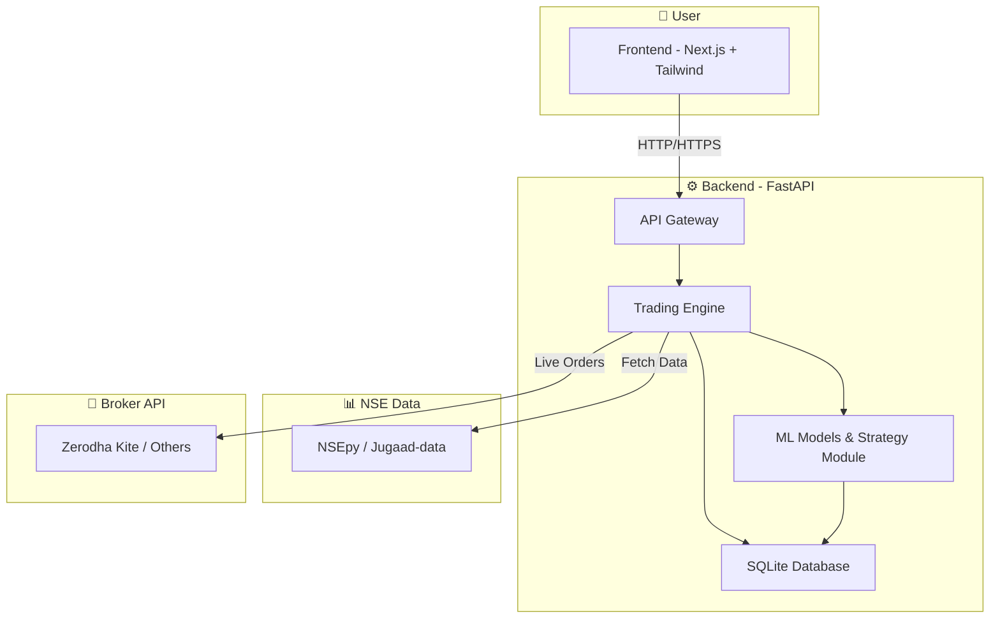

# Quarks Finance  

[](https://nextjs.org/)  
[](https://www.typescriptlang.org/)  
[](https://tailwindcss.com/)  

## 📌 Project Idea Summary  

**QuarkFinance** simulates real-world stock trading using live and historical data from the NSE.  
It allows users to simulate cash-less portfolios, try out strategy backtests, as well as run live trading strategies.  

### 🎯 Objectives  

- **Democratize Algorithmic Trading** – Make algo-trading accessible to retail traders, developers, and researchers by providing a free, open-source alternative to proprietary trading platforms.  
- **Backtesting & Simulation** – Enable robust historical backtesting with realistic market conditions.  
- **Paper Trading** – Support simulated trading for risk-free strategy validation.  
- **Machine Learning & AI Support** – Facilitate predictive trading strategies using ML models.  
- **Live Strategy Implementation** – Integrate with brokers (e.g., Zerodha Kite) for real-time execution.  

---

## 🚀 Features  

- 📊 Interactive financial dashboards  
- 📈 Stock market analysis tools  
- 🔄 Real-time & historical market data visualization  
- 📱 Responsive design for all devices  
- 🎨 Modern UI with smooth animations  
- 🔒 Secure authentication flows  
- 📱 Mobile-first approach  
- 🎵 Hidden audio player (Ctrl+Shift+Q)  
- 📈 Advanced stock charting with real-time updates  

---

## 🛠️ Technologies to be Used  

- **Market Data Retrieval**: NSEpy, Jugaad-data (for NSE real-time & historical data)  
- **Data Processing**: Numpy, Pandas, Matplotlib  

- **Database**: SQLite3  
- **Backend**: FastAPI (for asynchronous communication between server & frontend)  
- **Frontend**: Next.js (TypeScript + TailwindCSS), Figma for UI design  
- **Data Visualization**: ApexCharts, Chart.js  
- **State Management**: React Context API  
- **Animations**: Framer Motion  
- **Deployment & Automation**: CPanel actions for cron jobs and live strategy implementation  

---

## 🏗️ System Architecture  



---

## 📂 Project Structure

```
quarksFinanceFE/
├── src/
│   ├── app/                 # App router pages and layouts
│   ├── components/          # Reusable UI components
│   │   ├── dashboard/       # Dashboard components
│   │   ├── landing/         # Landing page components
│   │   └── navigation/      # Navigation components
│   ├── services/            # API services and utilities
│   └── styles/              # Global styles
├── public/                  # Static assets
│   └── images/              # Image assets
├── components.json          # Component configuration
├── next.config.js           # Next.js configuration
├── package.json             # Project dependencies
└── tsconfig.json            # TypeScript configuration
```

---

## ⚡ Getting Started

### Prerequisites

* Node.js 18.0.0 or later
* npm or yarn package manager

### Installation

```bash
git clone https://github.com/your-username/quarks-finance-fe.git
cd quarks-finance-fe
npm install  # or yarn install
```

### Environment Setup

Create a `.env.local` file:

```env
NEXT_PUBLIC_API_URL=your_api_url_here
```

### Run Development Server

```bash
npm run dev   # or yarn dev
```

Open [http://localhost:3000](http://localhost:3000)

---

## 📈 Stock Charting Module

The project includes a production-ready stock charting module with the following features:

- Real-time candlestick charts with ApexCharts
- Live data updates via polling (every 60 seconds)
- Historical data visualization with multiple timeframes
- Fully responsive and mobile-friendly
- Clean, modular architecture with reusable components
- TypeScript type safety

### Components

- `StockChart.tsx` - Main chart component
- `SymbolSearch.tsx` - Input for user symbol
- `useFetchHistorical.ts` - Custom hook for fetching historical data
- `useStreamUpdate.ts` - Custom hook for real-time updates

### Usage

Visit `/stock-chart` to use the stock charting module.

---

## 📜 Available Scripts

* `npm run dev` – Start development server
* `npm run build` – Build for production
* `npm start` – Start production server
* `npm run lint` – Run ESLint

---

## 🔒 Hidden Features

* Press `Ctrl+Shift+Q` to toggle the audio player 🎵

---

## 📄 License
This project is licensed under the MIT License - see the [LICENSE](LICENSE) file for details.
